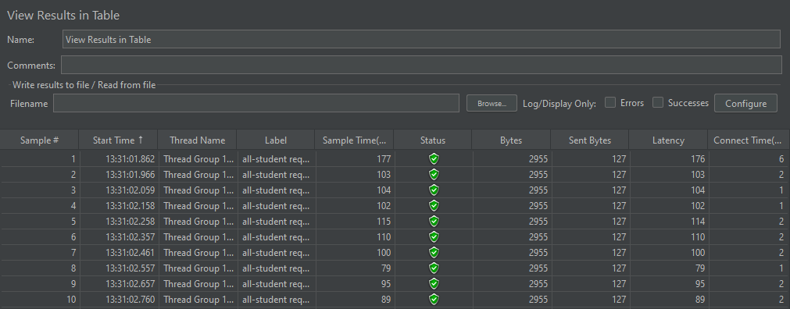
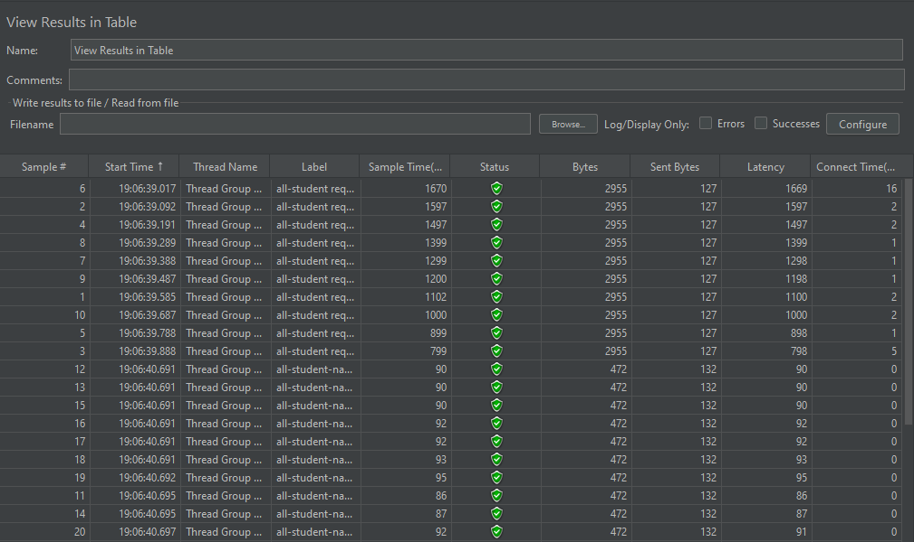
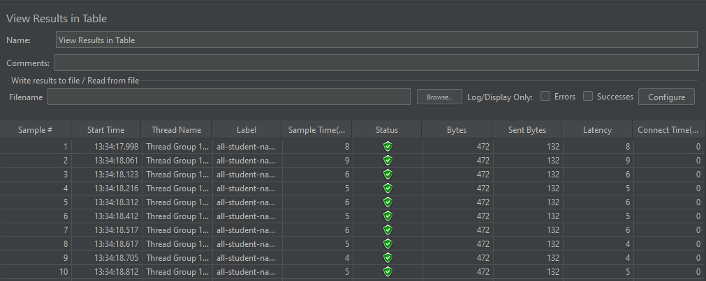
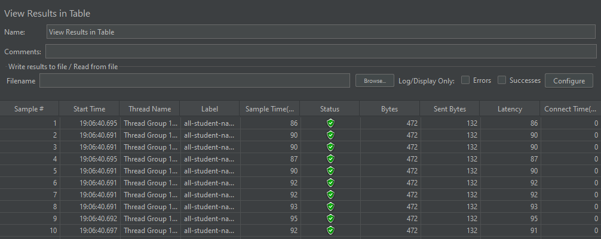
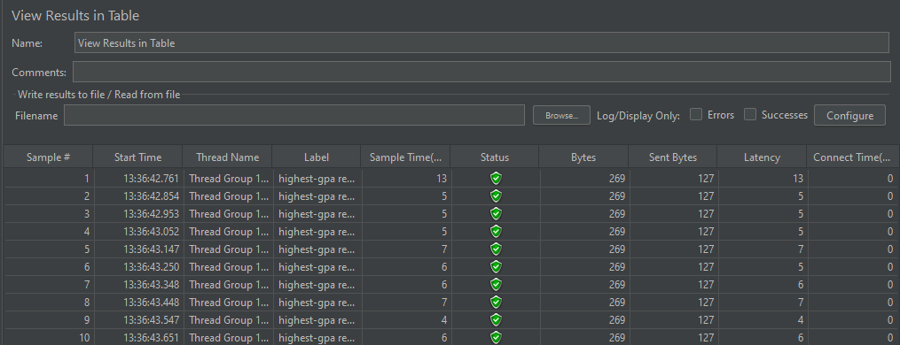
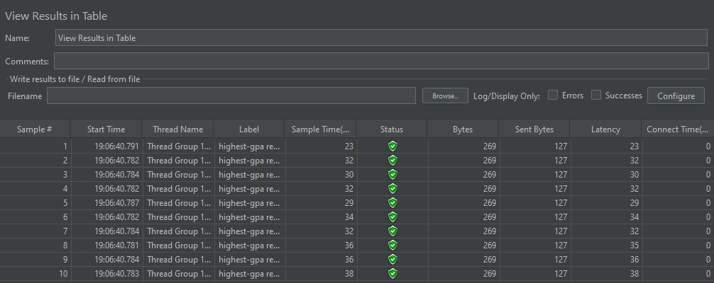
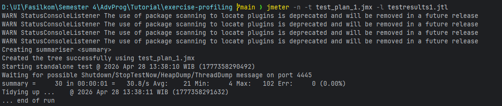
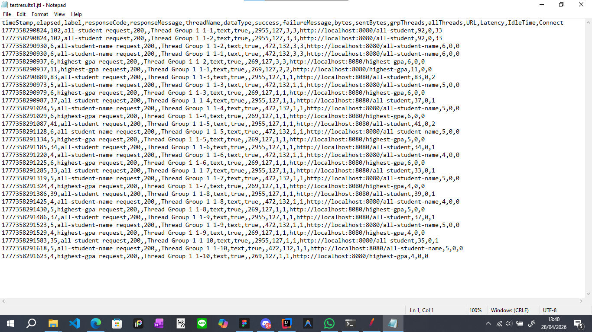

# Test Plan Screenshot

## all-students endpoint
### before optimization

### after optimization

## all-student-name endpoint
### before optimization

### after optimization

## highest-gpa endpoint
### before optimization

## after optimization

# Run JMeter via command line
I use 1 test plan for 3 endpoints so I just run it once.

Here's the result.
